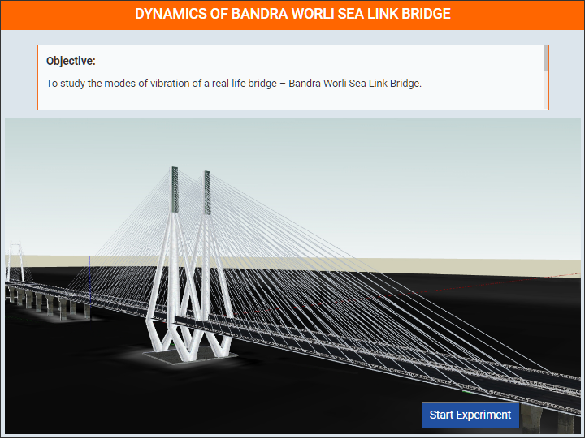
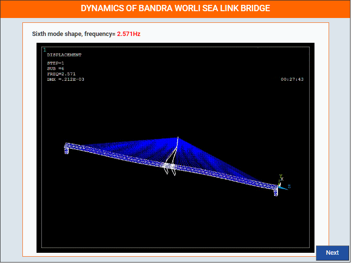
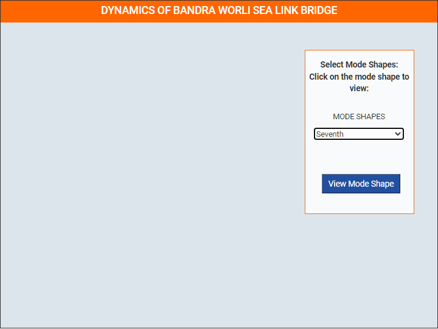

### These steps will be followed for the experiment
<!-- **PRE EXPERIMENT TASK**

1) What is mode shape? 
2) How is natural frequency related to mode shape? 
3) Draw first three modes of a simply supported bridge?  -->

**Step-1**

Click on start experiment button to start the experiment.

**Step-2**

Select condition first from drop down list and click on view mode shape button.

**Step-3**

Click on restart button.

**Step-1**

Click on start experiment button to start the experiment.

**Step-2**

Select condition second from drop down list and click on view mode shape button.

**Step-3**

Click on restart button.

**Step-1**

Click on start experiment button to start the experiment.

**Step-2**

Select condition third from drop down list and click on view mode shape button.

**Step-3**

Click on restart button.

**Step-1**

Click on start experiment button to start the experiment.

**Step-2**

Select condition fourth from drop down list and click on view mode shape button.

**Step-3**

Click on restart button.

**Step-1**

Click on start experiment button to start the experiment.

**Step-2**

Select condition fifth from drop down list and click on view mode shape button.

**Step-3**

Click on restart button.

**Step-1**

Click on start experiment button to start the experiment.

**Step-2**

Select condition sixth from drop down list and click on view mode shape button.

**Step-3**

Click on restart button.

**Step-1**

Click on start experiment button to start the experiment.

**Step-2**

Select condition seventh from drop down list and click on view mode shape button.

**Step-3**

Click on restart button.

**Step-1**

Click on start experiment button to start the experiment.

**Step-2**

Select condition eighth from drop down list and click on view mode shape button.

**Step-3**

Click on restart button.

**Step-1**

Click on start experiment button to start the experiment.

**Step-2**

Select condition nineth from drop down list and click on view mode shape button.

**Step-3**

Click on restart button.

**Step-1**

Click on start experiment button to start the experiment.

**Step-2**

Select condition tenth from drop down list and click on view mode shape button.

**Step-3**

Click on restart button.

<!-- **POST EXPERIMENT TASK**

1) Draw first three mode shapes of the bridge. 
2) According to you, which mode shape is most complicated?  -->
