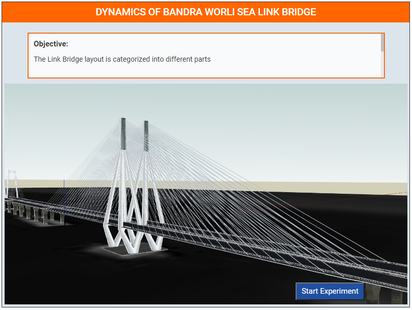
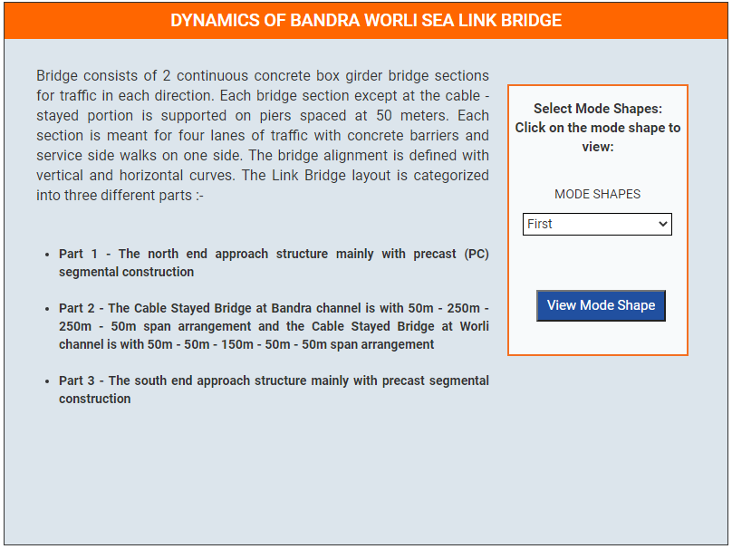
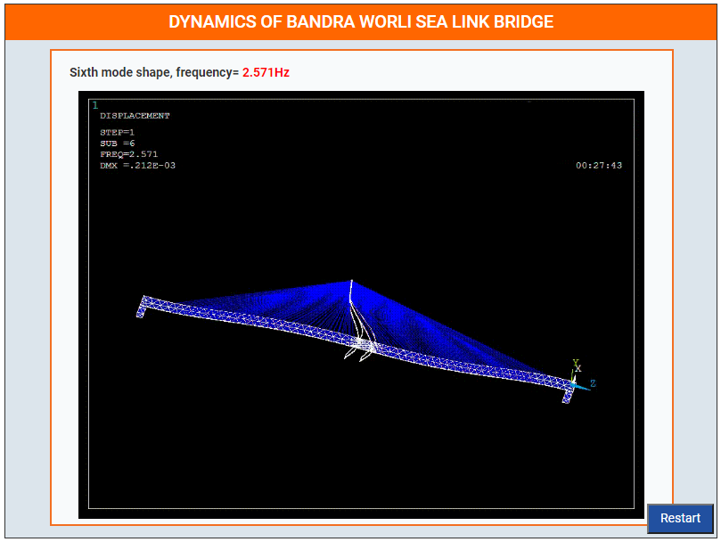
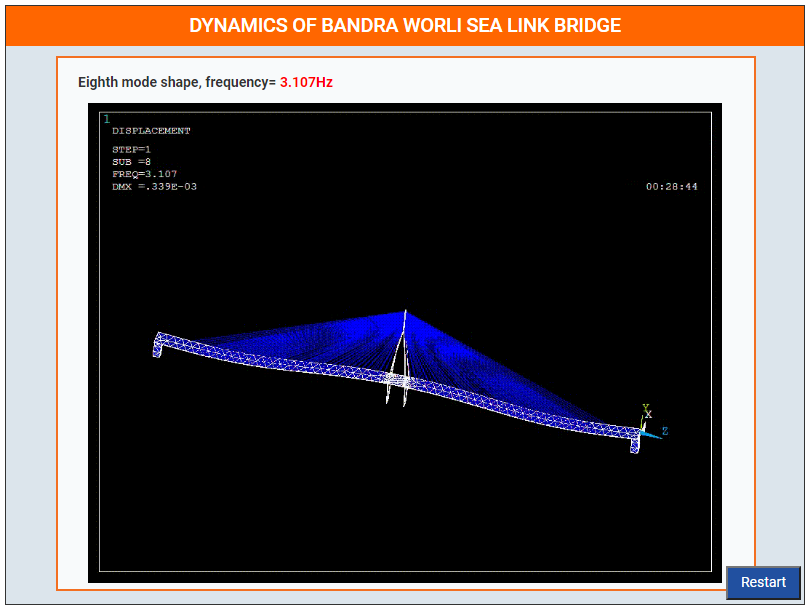

### These steps will be followed for the experiment
**Step-1**
 
Click on **Start Experiment Button** to start the experiment.
 
 
**Step-2**
 
Select condition first from drop down list and click on **View Mode Shape Button**.
 

 
 
**Step-3**
 
Click on **Restart Button**.
   
**Step-1**
 
Click on **Start Experiment Button** to start the experiment.
 
 
**Step-2**
 
Select condition Second from drop down list and click on **View Mode Shape Button**.
 

 
 
**Step-3**
 
Click on **Restart Button**.
   
**Step-1**
 
Click on **Start Experiment Button** to start the experiment.
 
 
**Step-2**
 
Select condition Third from drop down list and click on **View Mode Shape Button**.
 

 
 
**Step-3**
 
Click on **Restart Button**.
   
**Step-1**
 
Click on **Start Experiment Button** to start the experiment.
 

**Step-2**
 
Select condition Fourth from drop down list and click on **View Mode Shape Button**.
 

 
 
**Step-3**
 
Click on **Restart Button**.
   
**Step-1**
 
Click on **Start Experiment Button** to start the experiment.
 

**Step-2**
 
Select condition Fifth from drop down list and click on **View Mode Shape Button**.
 

 
 
**Step-3**
 
Click on **Restart Button**.
   
**Step-1**
 
Click on **Start Experiment Button** to start the experiment.
 

**Step-2**
 
Select condition Sixth from drop down list and click on **View Mode Shape Button**.
 

 
 
**Step-3**
 
Click on **Restart Button**.
   
**Step-1**
 
Click on **Start Experiment Button** to start the experiment.
 

**Step-2**
 
Select condition Seventh from drop down list and click on **View Mode Shape Button**.
 

 
 
**Step-3**
 
Click on **Restart Button**.
   
**Step-1**
 
Click on **Start Experiment Button** to start the experiment.
 

**Step-2**
 
Select condition Eighth from drop down list and click on **View Mode Shape Button**.
 

 
 
**Step-3**
 
Click on **Restart Button**.
   
**Step-1**
 
Click on **Start Experiment Button** to start the experiment.
 

**Step-2**
 
Select condition Nineth from drop down list and click on **View Mode Shape Button**.
 

 
 
**Step-3**
 
Click on **Restart Button**.
 
  
**Step-1**
 
Click on **Start Experiment Button** to start the experiment.
 

**Step-2**
 
Select condition Tenth from drop down list and click on **View Mode Shape Button**.
 

 
 
**Step-3**
 
Click on **Restart Button**.
 
